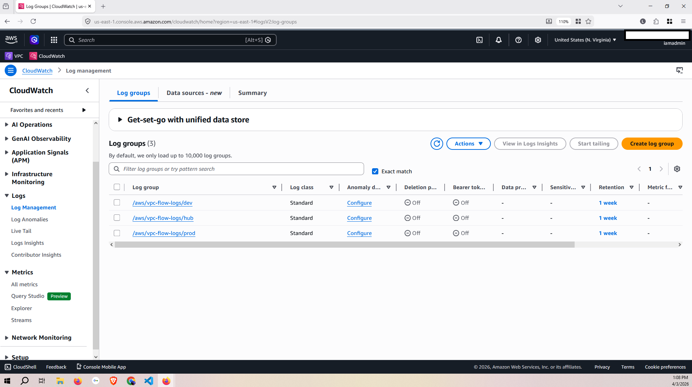
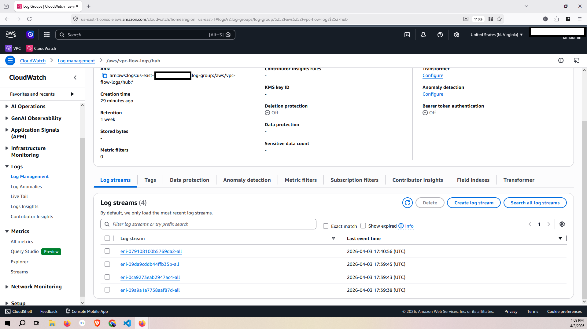
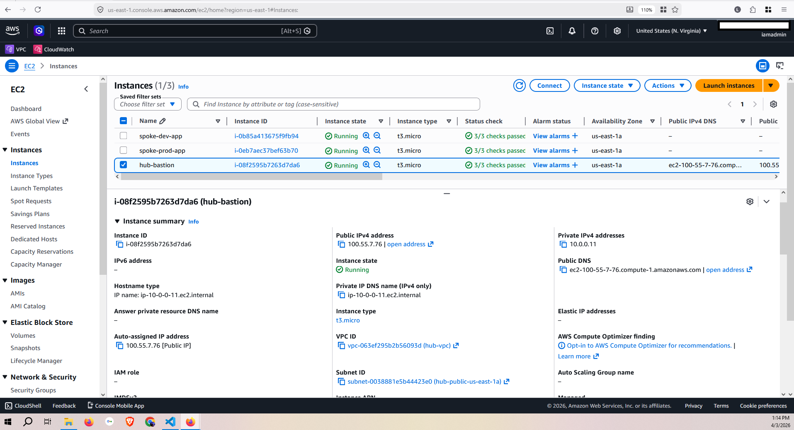
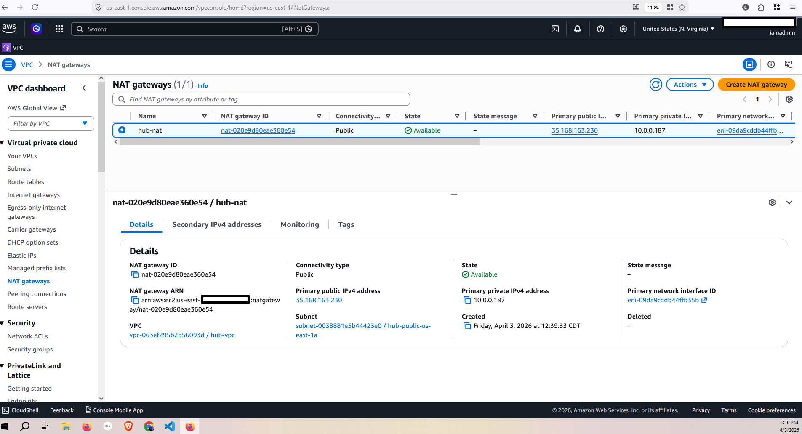
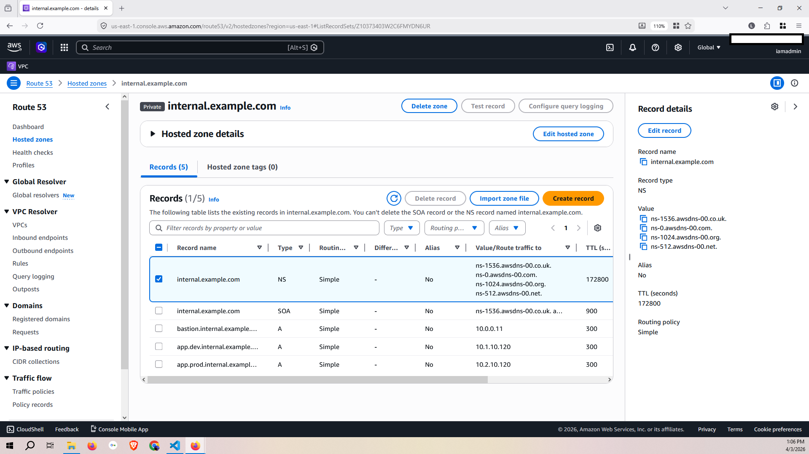
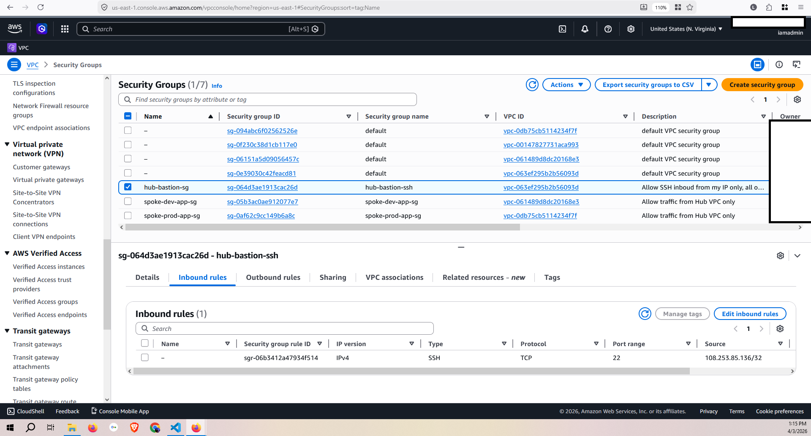
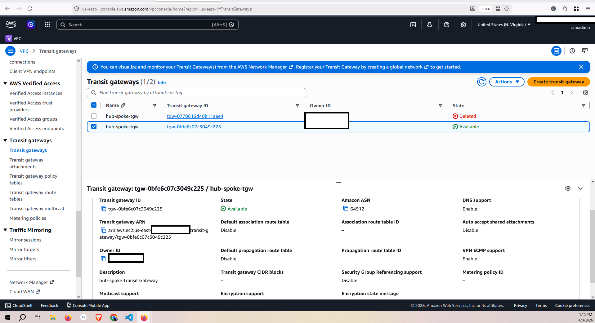
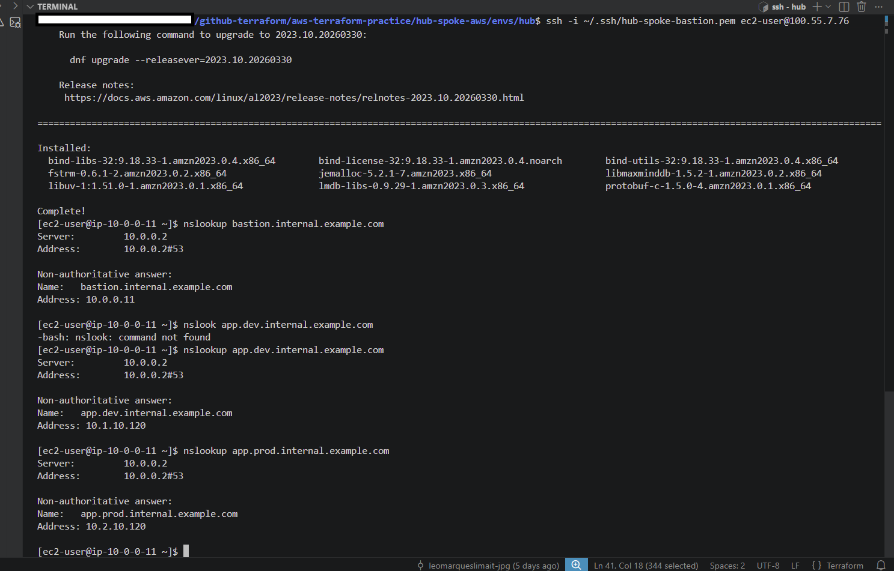

# AWS Hub-and-Spoke Network Architecture

## Overview

This project implements a hub-and-spoke network architecture on AWS using Terraform reusable modules for scalability. It consists of a Hub VPC and two spoke VPCs — one for production and one for development. Spoke VPCs contain only private subnets and have no direct internet access. The Hub VPC centralizes shared services: a NAT Gateway for outbound internet access, a Transit Gateway to connect all VPCs without VPC peering, a Route 53 private hosted zone for internal DNS resolution, and a bastion host as the single secure entry point to access private instances across spoke VPCs.

---

## Architecture Diagram

```
                    ┌─────────────────────────────────────────┐
                    │              Hub VPC (10.0.0.0/16)       │
                    │                                         │
                    │  Public Subnets                         │
                    │  ┌──────────┐  ┌─────────┐             │
                    │  │ Bastion  │  │   IGW   │             │
                    │  └──────────┘  └─────────┘             │
                    │                    │                    │
                    │  Private Subnets   │                    │
                    │  ┌─────────────────▼──────────────┐    │
                    │  │         NAT Gateway             │    │
                    │  └─────────────────────────────────┘    │
                    │                                         │
                    │  Route 53 Private Zone                  │
                    │  internal.example.com                   │
                    └──────────────┬──────────────────────────┘
                                   │
                        ┌──────────▼──────────┐
                        │   Transit Gateway    │
                        └──┬──────────────┬───┘
                           │              │
           ┌───────────────▼──┐    ┌──────▼────────────┐
           │  Spoke Dev VPC   │    │  Spoke Prod VPC    │
           │  10.1.0.0/16     │    │  10.2.0.0/16       │
           │                  │    │                    │
           │  Private subnets │    │  Private subnets   │
           │  App EC2         │    │  App EC2           │
           └──────────────────┘    └────────────────────┘
```

---

## Modules

| Module | Description |
|---|---|
| `modules/vpc` | Reusable VPC factory — creates VPC, subnets, route tables, IGW, NAT Gateway |
| `modules/tgw` | Transit Gateway — attachments, route tables, associations, propagations |
| `modules/dns` | Route 53 private hosted zone and spoke VPC associations |
| `modules/flow_logs` | VPC Flow Logs to CloudWatch for all VPCs |

---

## Environments

| Environment | CIDR | Description |
|---|---|---|
| `envs/hub` | 10.0.0.0/16 | Hub VPC — owns TGW, NAT, Bastion, DNS |
| `envs/spoke-dev` | 10.1.0.0/16 | Development spoke — private subnets only |
| `envs/spoke-prod` | 10.2.0.0/16 | Production spoke — private subnets only |

---

## Skills Learned

### Terraform

I learned how to use multi-environment deployment. Each environment has a separate state file in an S3 bucket. We create a backend block where Terraform stores the state files. We can reference resources and attributes from other modules and environments using these state files. To access data from another environment you need to not only pass a backend block in each environment, but also pass a data block containing a backend attribute referencing the state file you want to access.

### AWS and Networking

Creating defense in depth with VPCs that have only private subnets, only being able to communicate with each other via Transit Gateway in the Hub VPC. The spoke VPCs are completely private and can only be accessed via the bastion in the Hub VPC. I also learned how to deploy a Transit Gateway — route tables in each VPC are not enough. You also have to create route tables, associations, and the desired propagations in the TGW itself, as well as attachments.

It was also great creating a private Route 53 hosted zone and seeing instances in different VPCs being able to communicate with each other using an A record instead of an IP address.

---

## Biggest Challenge

One of the biggest challenges was dealing with resources that Terraform does not always destroy cleanly, such as CloudWatch Log Groups and Route 53 hosted zones. This can make redeployments messy — the resource still exists in AWS but Terraform has no record of it in state, so it tries to create it again and fails. You have to either import the existing resource into Terraform state, or delete it manually through the AWS Console or CLI before reapplying.

---

## Intended Audience

This project is intended to show some of my networking skills and architecture capabilities. It is aimed at roles such as Cloud Engineer, Solutions Architect, or DevOps Engineer where understanding how to design and deploy secure, scalable network infrastructure on AWS is important. I wanted to demonstrate that I can not only deploy individual resources, but also think about how they connect to each other, why certain design decisions are made, and how to organize infrastructure as reusable code that can scale as the project grows.

---

## Design Decisions

See [modules/vpc/DECISIONS.md](modules/vpc/DECISIONS.md) for notes on key design decisions made during development, including the choice between inline routes and separate `aws_route` resources.

### Route 53 Private Zone — why the Hub VPC owns it

The `aws_route53_zone` resource needs at least one VPC association at creation time — you can't stand up a private hosted zone with zero VPCs attached. I used `hub_vpc_id` for that first, required association, since the Hub VPC is the one VPC guaranteed to exist for the life of the project. The dev and prod spoke VPCs get associated afterward through a separate `aws_route53_zone_association` resource, looped with `for_each` over a map of spoke VPC IDs (`spoke_vpc_ids`).

This also fits how the rest of the hub-and-spoke design works. The Hub VPC already holds every shared service — NAT Gateway, the Transit Gateway attachment, the bastion — so the DNS zone living there too keeps all shared infrastructure in one place instead of splitting it across VPCs. It also means the zone's lifecycle isn't tied to any one spoke: if I tear down spoke-dev, only its `aws_route53_zone_association` gets destroyed. The zone itself, and its record for spoke-prod, keep working.

One thing to watch for if the spokes ever move into separate AWS accounts: cross-account zone associations need an `aws_route53_vpc_association_authorization` resource in the spoke account before the hub account is allowed to associate it. Everything here is in one account, so I didn't need that step, but it'd be required in a real multi-account setup.

### Why default_route_table_association and default_route_table_propagation are disabled

By default, a Transit Gateway auto-creates one route table and every attachment auto-associates and auto-propagates into it. That means the moment I attached the hub, dev, and prod VPCs, all three would land in the same table with all three CIDRs visible to each other — full mesh reachability through the TGW, with no way to stop dev and prod from talking directly to each other.

I set `default_route_table_association = "disable"` and `default_route_table_propagation = "disable"` on the `aws_ec2_transit_gateway` resource, and repeated `transit_gateway_default_route_table_association = false` / `transit_gateway_default_route_table_propagation = false` on each `aws_ec2_transit_gateway_vpc_attachment`, so none of that happens automatically. Instead I built two route tables by hand — `hub` and `spoke` — and control exactly what goes into each:

- The hub attachment associates only to the `hub` route table.
- The dev and prod attachments associate only to the `spoke` route table.
- Spoke CIDRs propagate into the `hub` table, so the hub can reach both spokes.
- The hub's default route propagates into the `spoke` table, so spokes can reach the internet through the hub's NAT Gateway.
- Spoke CIDRs are never propagated into the `spoke` table itself, so dev and prod share a route table but never learn each other's routes.

That last point is what actually enforces the "spokes can't talk to each other directly" rule from my architecture. Disabling the defaults costs a few extra resources in the module, but it's what lets the TGW route table itself do the isolation, instead of relying only on security groups or NACLs to block spoke-to-spoke traffic after the fact.

The routes that get injected into the Hub's private route table (`aws_route.hub_to_spoke`) work the same way, and for a related reason. The IDs they need — route table IDs, subnet IDs — come from the VPC module's outputs, referenced through variables, not by reaching directly into another module's resources. I did this on purpose, to keep the VPCs separated — each one is a self-contained network that doesn't know anything about other VPCs or about the TGW. The `vpc` module only ever knows about its own subnets, route tables, and gateway. It outputs its IDs, and the `tgw` module takes those IDs in as variables and injects the routes from the outside. If I ever want to reuse the `vpc` module somewhere with no TGW at all, it doesn't need to change — it was never written to know a TGW exists.

### Transit Gateway over VPC Peering — even though it costs more

VPC peering is cheaper. There's no hourly charge for a peering connection, just standard data transfer rates. A Transit Gateway costs about $0.05/hr per attachment plus a per-GB data processing fee on top of transfer costs, so for this project peering would have been the cheaper option on paper.

I used TGW anyway because peering doesn't scale the way this architecture needed it to. Peering connections are point-to-point and not transitive — if spoke-dev and spoke-prod were both peered to the hub, they still couldn't reach each other through the hub. Each pair of VPCs that needs to talk needs its own direct peering connection. With three VPCs that's manageable, but the moment you add a fourth or fifth VPC, or want a shared-services VPC that other VPCs route through, the number of connections needed grows fast (full mesh is N(N-1)/2 connections), and every one of them needs its own manually maintained route table entries.

TGW solves this by acting like a router in the middle. Every VPC attaches to it once, and the TGW route tables decide who can reach who. In this project, the Hub VPC's NAT Gateway and bastion are exactly the kind of shared services that spoke VPCs need to reach without being directly peered to each other, so TGW was the right call architecturally even at a higher hourly cost. For a simpler 2-VPC setup with no shared services in the middle, I'd use peering instead.

---

## Deployment Evidence

### CloudWatch Log Groups — VPC Flow Logs for all three VPCs


### CloudWatch Log Streams — Active ENI flow log entries in Hub VPC


### EC2 Instances — Bastion in Hub public subnet, App instances in private spoke subnets


### NAT Gateway — Centralized internet egress in Hub VPC public subnet


### Hub Private Route Table — All four routes active (local, NAT, spoke-dev via TGW, spoke-prod via TGW)


### Route 53 Private Hosted Zone — DNS records for all three instances


### Security Groups — Bastion SSH restricted to single IP, spoke instances allow Hub VPC only


### Transit Gateway — Hub-spoke TGW available and connected


### DNS Resolution — nslookup resolving all three hostnames from bastion across VPCs


---

## Prerequisites

- AWS CLI configured with appropriate credentials
- Terraform >= 1.5.0
- An existing EC2 Key Pair in your AWS account
- S3 bucket and DynamoDB table for remote state (see Bootstrap section)

---

## Bootstrap Remote State

Before deploying, create the S3 bucket and DynamoDB table manually:

```bash
# Create S3 bucket
aws s3api create-bucket \
  --bucket your-tf-state-bucket \
  --region us-east-1

# Enable versioning
aws s3api put-bucket-versioning \
  --bucket your-tf-state-bucket \
  --versioning-configuration Status=Enabled

# Enable encryption
aws s3api put-bucket-encryption \
  --bucket your-tf-state-bucket \
  --server-side-encryption-configuration \
  '{"Rules":[{"ApplyServerSideEncryptionByDefault":{"SSEAlgorithm":"AES256"}}]}'

# Create DynamoDB lock table
aws dynamodb create-table \
  --table-name tf-state-lock \
  --attribute-definitions AttributeName=LockID,AttributeType=S \
  --key-schema AttributeName=LockID,KeyType=HASH \
  --billing-mode PAY_PER_REQUEST \
  --region us-east-1
```

Update the bucket name in all three `providers.tf` files:
```
envs/hub/providers.tf
envs/spoke-dev/providers.tf
envs/spoke-prod/providers.tf
```

---

## Deployment

Deploy in this order — spokes must exist before hub can create TGW attachments:

```bash
# 1. Deploy spoke-dev
cd envs/spoke-dev
terraform init
terraform apply

# 2. Deploy spoke-prod
cd ../spoke-prod
terraform init
terraform apply

# 3. Deploy hub last
cd ../hub
terraform init
terraform apply
```

Create a `terraform.tfvars` file in `envs/hub/` with your values:

```hcl
key_pair_name    = "your-key-pair-name"
allowed_ssh_cidr = "YOUR_IP/32"
```

---

## Testing Connectivity

Get the bastion public IP:
```bash
cd envs/hub
terraform output -raw bastion_public_subnet_ip
```

SSH to bastion:
```bash
ssh -i ~/.ssh/your-key.pem ec2-user@<bastion_ip>
```

From bastion — test DNS resolution:
```bash
dig bastion.internal.example.com
dig app.dev.internal.example.com
dig app.prod.internal.example.com
```

Jump to a spoke instance:
```bash
ssh -A -i ~/.ssh/your-key.pem \
  -J ec2-user@<bastion_ip> \
  ec2-user@<spoke_private_ip>
```

Test internet egress via NAT:
```bash
curl https://checkip.amazonaws.com
# Should return NAT Gateway IP, not bastion IP
```

---

## Cost Estimate

| Resource | Hourly Cost |
|---|---|
| Transit Gateway | $0.05/hr |
| TGW Attachments (x3) | $0.05/hr each |
| NAT Gateway | $0.045/hr |
| EC2 t3.micro (x3) | ~$0.01/hr each |
| Route 53 Private Zone | $0.50/month |
| **Total** | **~$0.25/hr** |

Destroy resources when not in use to minimize costs.

---

## Destroy

Destroy in reverse order:

```bash
cd envs/hub && terraform destroy
cd ../spoke-dev && terraform destroy
cd ../spoke-prod && terraform destroy
```

> Note: CloudWatch Log Groups and Route 53 hosted zones may need to be
> deleted manually via the AWS Console or CLI if Terraform fails to destroy them.
